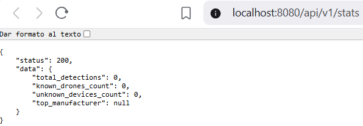
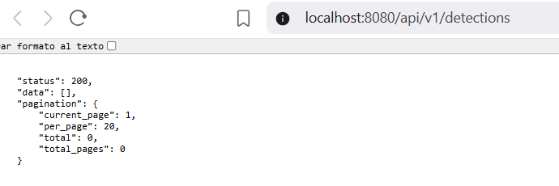
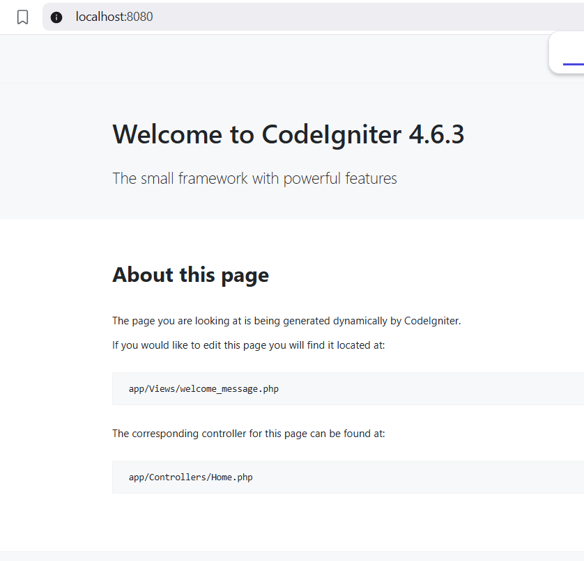
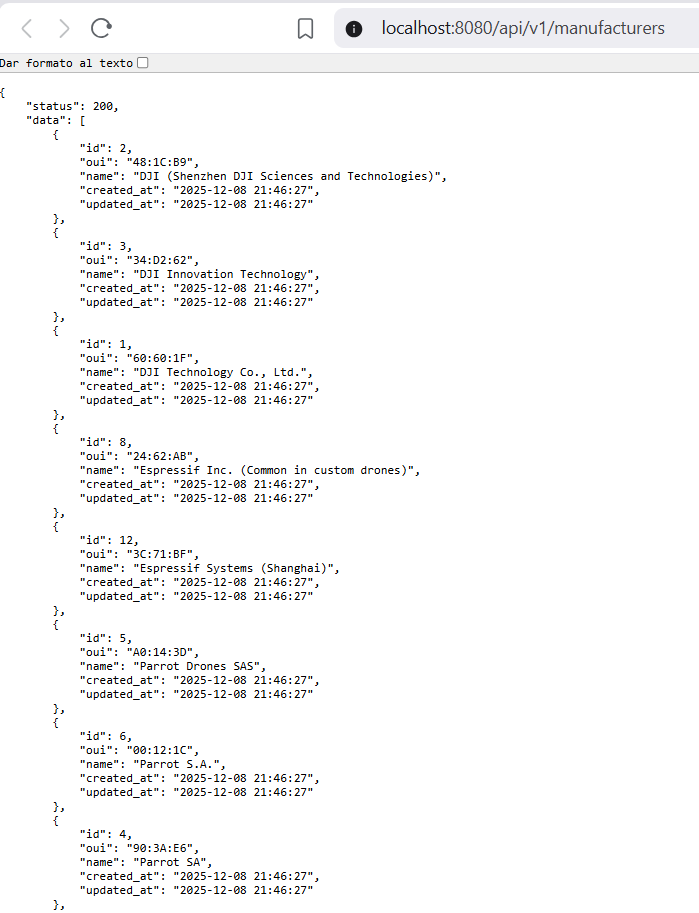

[](https://classroom.github.com/a/FpM8eaVc)
# API REST de Detección de Drones con CodeIgniter 4

API REST que funciona como orquestador central para un sistema de detección de drones Wi-Fi. Basado en el artículo [Detección de Drones Wi-Fi](https://medium.com/@noko_kelevra/detecci%C3%B3n-de-drones-wi-fi-64b9cbdef2a6).

## Descripción

Esta API tiene dos responsabilidades principales:
1. **Recibir datos de sensores**: Los scripts Python de detección envían información sobre direcciones MAC detectadas.
2. **Servir datos al frontend**: Proporciona endpoints para un futuro panel de control/dashboard.

## 📋 Requisitos del Sistema

- PHP 8.1 o superior
- Composer
- Extensiones PHP: `intl`, `mbstring`, `sqlite3`

## 🚀 Instalación y Configuración

### 1. Clonar el repositorio
```bash
git clone <url-del-repositorio>
cd api-drones
```

### 2. Instalar dependencias
```bash
composer install
```

### 3. Configurar el entorno

**Para Windows (PowerShell):**
```powershell
Copy-Item env .env
```

**Para Linux/Mac:**
```bash
cp env .env
```

Editar el archivo `.env` con la siguiente configuración mínima:
```ini
CI_ENVIRONMENT = development

app.baseURL = http://localhost:8080/
```

> **Nota importante**: La configuración de la base de datos SQLite ya está preconfigurada en `app/Config/Database.php` para usar `writable/database.sqlite` automáticamente. No es necesario configurar nada en el archivo `.env` para la base de datos.

### 4. Crear archivo de base de datos

**Para Windows (PowerShell):**
```powershell
New-Item -ItemType File -Path "writable/database.sqlite" -Force
```

**Para Linux/Mac:**
```bash
touch writable/database.sqlite
```

### 5. Ejecutar migraciones
```bash
php spark migrate --all
```

### 6. Ejecutar seeders (poblar base de datos con fabricantes)
```bash
php spark db:seed ManufacturerSeeder
```

### 7. Iniciar el servidor de desarrollo
```bash
php spark serve
```

El servidor estará disponible en: `http://localhost:8080`


*Figura 1: Página de bienvenida de CodeIgniter 4.6.3 - Confirma que el servidor está funcionando correctamente*

## 📸 Capturas de Funcionamiento

### GET /api/v1/manufacturers
Lista todos los fabricantes de drones precargados en la base de datos.


*Figura 2: Endpoint que devuelve la lista completa de fabricantes conocidos con sus OUIs*

### POST /api/v1/detections
Registra una nueva detección de drone con información del sensor.


*Figura 3: Ejemplo de registro de detección con identificación automática del fabricante por OUI*

### GET /api/v1/stats
Muestra estadísticas globales del sistema de detección.


*Figura 4: Dashboard con métricas de detecciones totales, drones conocidos y desconocidos*

## 🗄️ Estructura de la Base de Datos

### Tabla `manufacturers`
| Columna | Tipo | Descripción |
|---------|------|-------------|
| id | INTEGER (PK) | Identificador único |
| oui | VARCHAR(8) | OUI del fabricante (ej: '60:60:1F') |
| name | VARCHAR(255) | Nombre del fabricante |
| created_at | DATETIME | Fecha de creación |
| updated_at | DATETIME | Fecha de actualización |

### Tabla `detections`
| Columna | Tipo | Descripción |
|---------|------|-------------|
| id | INTEGER (PK) | Identificador único |
| mac_address | VARCHAR(17) | Dirección MAC completa |
| manufacturer_id | INTEGER (FK) | Referencia a manufacturers (nullable) |
| rssi | INTEGER | Intensidad de la señal |
| sensor_location | VARCHAR(255) | Ubicación del sensor |
| detected_at | DATETIME | Fecha/hora de detección |
| created_at | DATETIME | Fecha de creación del registro |

## 🔌 Endpoints de la API

Base URL: `http://localhost:8080/api/v1`

### POST /detections
Registra una nueva detección de una dirección MAC.

**Request Body:**
```json
{
    "mac": "60:60:1F:AA:BB:CC",
    "rssi": -50,
    "sensor_location": "Edificio A - Planta 3",
    "timestamp": "2024-01-15T10:30:00Z"
}
```

**Response (201 Created):**
```json
{
    "status": 201,
    "message": "Detección registrada correctamente.",
    "data": {
        "id": 1,
        "mac_address": "60:60:1F:AA:BB:CC",
        "manufacturer_id": 1,
        "rssi": -50,
        "sensor_location": "Edificio A - Planta 3",
        "detected_at": "2024-01-15 10:30:00",
        "created_at": "2024-01-15 10:30:05",
        "manufacturer_name": "DJI Technology Co., Ltd."
    }
}
```

### GET /detections
Lista paginada de detecciones.

**Query Parameters:**
| Parámetro | Tipo | Opcional | Default | Descripción |
|-----------|------|----------|---------|-------------|
| page | int | Sí | 1 | Página actual |
| limit | int | Sí | 20 | Resultados por página (máx 100) |
| manufacturer_id | int | Sí | - | Filtrar por fabricante |
| location | string | Sí | - | Filtrar por ubicación del sensor |

**Response (200 OK):**
```json
{
    "status": 200,
    "data": [...],
    "pagination": {
        "current_page": 1,
        "per_page": 20,
        "total": 100,
        "total_pages": 5
    }
}
```

### GET /detections/latest
Obtiene las 5 detecciones más recientes.

**Response (200 OK):**
```json
{
    "status": 200,
    "data": [...]
}
```

### GET /manufacturers
Lista de todos los fabricantes de drones conocidos.

**Response (200 OK):**
```json
{
    "status": 200,
    "data": [
        {
            "id": 1,
            "oui": "60:60:1F",
            "name": "DJI Technology Co., Ltd.",
            "created_at": "2024-01-15 10:00:00",
            "updated_at": "2024-01-15 10:00:00"
        }
    ]
}
```

### GET /stats
Estadísticas para el dashboard.

**Response (200 OK):**
```json
{
    "status": 200,
    "data": {
        "total_detections": 1138,
        "known_drones_count": 820,
        "unknown_devices_count": 318,
        "top_manufacturer": "DJI Technology Co., Ltd."
    }
}
```

## 📦 Fabricantes Precargados (Seeder)

El seeder incluye OUIs de los siguientes fabricantes:
- DJI Technology Co., Ltd. (varios OUIs)
- Parrot SA / Parrot Drones SAS
- Yuneec International
- Espressif Inc. (común en drones DIY)
- Raspberry Pi Foundation (drones DIY)

## 📮 Colección Postman

Importa el archivo `Drone_Detection_API.postman_collection.json` en Postman para probar todos los endpoints fácilmente. La colección incluye:

- ✅ Ejemplos de todas las peticiones (GET, POST)
- ✅ Variables de entorno preconfiguradas
- ✅ Casos de prueba con datos de ejemplo
- ✅ Documentación de respuestas esperadas

## ⚙️ Comandos Útiles

```bash
# Ejecutar migraciones
php spark migrate --all

# Revertir migraciones
php spark migrate:rollback

# Ejecutar seeder
php spark db:seed ManufacturerSeeder

# Iniciar servidor
php spark serve

# Ver rutas disponibles
php spark routes
```

## 🛠️ Tecnologías Utilizadas

- **Framework**: CodeIgniter 4.6.3
- **Lenguaje**: PHP 8.1+
- **Base de datos**: SQLite3
- **Arquitectura**: API REST
- **Patrón**: MVC (Model-View-Controller)

## 🎯 Características Implementadas

- ✅ **CRUD completo** de detecciones de drones
- ✅ **Identificación automática** de fabricantes por OUI (primeros 3 octetos de la MAC)
- ✅ **Paginación** en listado de detecciones
- ✅ **Filtros avanzados** por fabricante y ubicación
- ✅ **Estadísticas en tiempo real** para dashboard
- ✅ **Base de datos SQLite** portable y sin configuración adicional
- ✅ **Seeders** con fabricantes de drones reales
- ✅ **Validación de datos** en todas las peticiones
- ✅ **Respuestas JSON estandarizadas** con códigos HTTP apropiados
- ✅ **Documentación completa** con ejemplos y capturas

## 📝 Notas Técnicas

### Configuración de Base de Datos
La aplicación está configurada para usar SQLite3 con la ruta relativa `WRITEPATH . 'database.sqlite'`, lo que hace que funcione automáticamente en cualquier sistema operativo sin necesidad de configurar rutas absolutas en el archivo `.env`.

### Identificación de Fabricantes
El sistema utiliza el OUI (Organizationally Unique Identifier) - los primeros 3 octetos de una dirección MAC - para identificar automáticamente al fabricante del dispositivo detectado. Esto permite clasificar si un dispositivo es un drone conocido o un dispositivo desconocido.

### Estructura de Respuestas
Todas las respuestas de la API siguen un formato consistente:
```json
{
    "status": <código_http>,
    "message": "<mensaje_descriptivo>",  // Solo en errores o creaciones
    "data": { ... },  // Datos de respuesta
    "pagination": { ... }  // Solo en listados paginados
}
```

## 📄 Licencia

Proyecto educativo - Desarrollo en Entorno Servidor - 2º Grado en Ingeniería Informática
